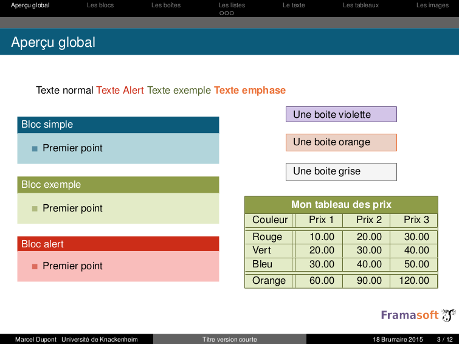

# BredeleDiapo

La classe LaTeX Bredelebeamer est placée sous licence GNU-GPL v3.

Il s'agit d'un style simple aux couleurs de Framasoft (http://framasoft.org), agrémenté de quelques boites et de modèles de tableaux.

L'ensemble est adaptable selon les besoins de l'utilisateur.

